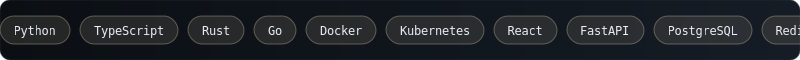
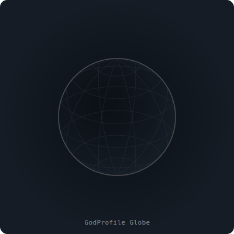

<div align="center">


<br/>

# GodProfile MCP Toolkit

**The MCP server that turns your GitHub profile README into a god-tier art exhibit.**
**Every visual in this README was generated by GodProfile itself.**

[](https://pypi.org/project/godprofile-mcp/)
[](https://python.org)
[](https://modelcontextprotocol.io)
[](LICENSE)
[](https://github.com/Luc0-0/GodProfile/stargazers)
[](CONTRIBUTING.md)
[](https://github.com/Luc0-0/GodProfile/actions)

<br/>

> Give Claude Desktop this server and say: **_"Make my GitHub profile god-tier."_**
> It ships 16 tools that generate glassmorphic SVGs, animated banners, live data widgets,
> bento-grid layouts, and full GitHub Actions CI — all from a single MCP config line.

[Quick Install](#-quick-install) · [Tools](#-16-tools) · [Themes](#-4-themes) · [MCP Config](#-mcp-config) · [Contributing](#-contributing)

</div>


## Terminal SVG — `render_terminal_emulator_svg`

> Animated typewriter terminal with macOS window chrome. Every line types itself in.

<div align="center">

</div>


## Icon Marquee — `generate_animated_icon_marquee`

> Infinitely scrolling CSS-animated band of tech badges. Seamless loop, zero JavaScript.

<div align="center">

</div>


## Neural Network Map — `generate_neural_network_map`

> Your tech stack as a Bezier-connected animated neural graph. Nodes pulse, edges flow.

<div align="center">

</div>


## GitHub Trophies — `render_github_trophies`

> Custom SVG trophy case with S/A/B/C rank tiers. S-rank trophies animate with a golden glow.

<div align="center">

</div>


## WakaTime Activity — `render_wakatime_activity_chart`

> Animated horizontal bar chart of your weekly coding language breakdown.

<div align="center">

</div>


## Spotify Now Playing — `render_spotify_now_playing`

> Branded "Now Playing" card with animated equalizer bars. Syncs via GitHub Actions cron.

<div align="center">

</div>


## Isometric 3D Globe — `render_3d_contribution_globe`

> Real spherical-to-isometric projection math. 12 longitude + 8 latitude lines. Slow animated rotation.

<div align="center">

</div>


## Quick Install

```bash
# Option 1 — uvx (zero install, runs directly)
uvx godprofile-mcp

# Option 2 — pip
pip install godprofile-mcp

# Option 3 — dev mode
git clone https://github.com/Luc0-0/GodProfile
cd GodProfile
pip install -e ".[dev]"
python examples/quickstart.py   # generates all SVGs to examples/output/
```

## MCP Config

Add to your `claude_desktop_config.json`:

```json
{
  "mcpServers": {
    "godprofile": {
      "command": "uvx",
      "args": ["godprofile-mcp"]
    }
  }
}
```

**macOS:** `~/Library/Application Support/Claude/claude_desktop_config.json`
**Windows:** `%APPDATA%\Claude\claude_desktop_config.json`

Restart Claude Desktop, then try:

> *"Use GodProfile to rebuild my README with the luxury-glass theme, a terminal SVG showing my stack, WakaTime coding stats, and an animated icon marquee."*


## 16 Tools

### Render Tools — pass your own data, get SVG back

| Tool | What it generates |
|------|-------------------|
| `refactor_readme_to_bento` | Asymmetric bento-grid HTML layout from your Markdown |
| `render_svg_widget` | Glassmorphic SVG stat cards with 12px borders + theme tokens |
| `generate_neural_network_map` | Animated Bezier-connected tech stack visualization |
| `setup_github_automation` | GitHub Actions workflows for automated stat sync |
| `render_spotify_now_playing` | "Now Playing" card with animated equalizer bars (placeholder) |
| `render_wakatime_activity_chart` | Horizontal bar chart from provided language percentages |
| `setup_contribution_snake` | Snake game eating your contribution grid (custom themed) |
| `render_3d_contribution_globe` | Isometric 3D globe using real lat/lon projection math |
| `fetch_latest_blog_posts` | RSS/Atom feed → styled SVG card of latest posts |
| `render_terminal_emulator_svg` | Animated typewriter terminal with macOS window chrome |
| `generate_animated_icon_marquee` | Infinite CSS-scrolling band of tech name badges |
| `capture_animated_banner_gif` | Pure SVG animated banner with gradient + sequential fade-in |
| `render_github_trophies` | Trophy case from provided stats dict, S/A/B/C tier rankings |

### Live-Fetch Tools — hit real APIs, get live SVG back

| Tool | What it fetches |
|------|-----------------|
| `fetch_github_trophies_live` | Pulls real stars/commits/PRs/repos/followers from GitHub API, renders trophy case |
| `fetch_wakatime_chart_live` | Calls WakaTime API with your key → renders last 7 days language chart |
| `fetch_spotify_now_playing_live` | Calls Spotify API with OAuth token → renders current track card |

## 4 Themes

| Theme | Vibe | Background | Accent |
|-------|------|-----------|--------|
| `luxury-glass` | Dark glassmorphic, gold accents | `#0b0f14` | `#b6a891` |
| `terminal-hacker` | Green-on-black matrix terminal | `#000000` | `#00ff41` |
| `minimalist` | Clean GitHub-native light mode | `#ffffff` | `#111827` |
| `cyberpunk` | Neon magenta/cyan high contrast | `#0d0221` | `#ff003c` |


## Architecture

```
godprofile_mcp/
├── server.py        ← 13 FastMCP @mcp.tool() endpoints
├── resources.py     ← 4 themes as theme://{name} MCP resources
├── prompts.py       ← Aesthetic design guide injected at generation time
└── core/
    ├── bento_layout.py          ← Asymmetric HTML table grid
    ├── svg_rendering.py         ← Glassmorphic SVG card engine
    ├── neural_bezier_engine.py  ← Bezier-connected tech stack map
    ├── github_ci_automation.py  ← GitHub Actions YAML generator
    ├── snake_game_injector.py   ← Contribution snake setup
    ├── blog_fetcher.py          ← RSS/Atom feed → SVG post card
    ├── terminal_emulator.py     ← Animated typewriter terminal SVG
    ├── icon_marquee.py          ← CSS infinite-scroll marquee SVG
    ├── animated_banner.py       ← Gradient animated banner SVG
    ├── github_trophies.py       ← Trophy case SVG with tier logic
    ├── spotify_now_playing.py   ← Spotify UI card + cron workflow
    ├── wakatime_metrics.py      ← Coding stats horizontal bar chart
    └── isometric_3d_globe.py   ← 3D isometric globe SVG
```

**Design principles:**
- Zero external deps beyond `mcp` + `pydantic` — all SVG generation uses stdlib
- Self-contained inline SVGs (no CDN, no external requests at render time)
- Deterministic output — same inputs always produce the same SVG

## Why not a profile generator website?

| | GodProfile | Static generators | Manual editing |
|--|:--:|:--:|:--:|
| Conversational AI-driven | ✅ | ❌ | ❌ |
| Fully animated SVGs | ✅ | partial | ❌ |
| Live data (Spotify, WakaTime) | ✅ | some | ❌ |
| GitHub Actions automation | ✅ | ❌ | manual |
| Zero vendor lock-in | ✅ | ❌ | ✅ |
| Works offline / no API keys required | ✅ | ❌ | ✅ |
| Customizable themes | ✅ | limited | ✅ |


## Contributing

See [CONTRIBUTING.md](CONTRIBUTING.md). The short version:

1. Pick an open issue or check the roadmap below
2. Add your module to `src/godprofile_mcp/core/`
3. Wire it into `server.py` with `@mcp.tool()`
4. Keep deps to zero (stdlib only)
5. Open a PR — all skill levels welcome

## Roadmap

- [ ] `render_github_streak` — SVG contribution streak card
- [ ] `generate_skills_radar` — Radar/spider chart for skills
- [ ] `theme_editor` — Interactive theme token customizer
- [ ] `export_to_html` — Full standalone HTML profile export
- [ ] PyPI publish + versioned releases

Star the repo to follow progress.

<div align="center">


Built with [FastMCP](https://github.com/jlowin/fastmcp) · Protocol by [Anthropic](https://modelcontextprotocol.io) · MIT License

</div>
