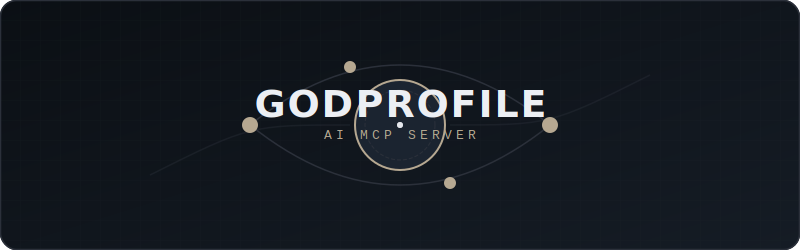

<p align="center">
  
</p>

# 🔱 GodProfile MCP Server

[](https://www.python.org/downloads/)
[](https://modelcontextprotocol.github.io/)
[](https://opensource.org/licenses/MIT)

An official **Model Context Protocol (MCP)** server enabling AI Agents (like Claude Desktop) to autonomously forge, refactor, and animate god-tier GitHub Profile READMEs.

GodProfile provides LLMs with the programmatic tools and aesthetic constraints required to upgrade standard Markdown profiles into animated, live-data injected "Bento Box" art exhibits.

<div align="center">
  
</div>

## ✨ Arsenal (The 12 Core Tools)

GodProfile exposes 12 massive generative capabilities native to your AI's logic engine:

1. **Bento Box Grids** (`refactor_readme_to_bento`): Restructures messy Markdown flows into Asymmetric HTML tables.
2. **Glassmorphic SVGs** (`render_svg_widget`): Generates complex offline SVG stat cards, avoiding Vercel API limits. 
3. **Neural Bezier Engines** (`generate_neural_network_map`): Calculates interconnected Bezier routes to generate an animated neural tech stack map.
4. **Spotify "Now Playing"** (`render_spotify_now_playing`): Injects Spotify APIs offline via Github Actions cron jobs.
5. **WakaTime Charts** (`render_wakatime_activity_chart`): Fetches coding metrics and mathematically renders SVGs.
6. **Contribution Snake** (`setup_contribution_snake`): Automates `Platane/snk` using custom Theme Hex colors.
7. **Isometric 3D Globe** (`render_3d_contribution_globe`): Auto-rotates your worldwide global GitHub traffic.
8. **Dev.to/Medium Blog Fetcher** (`fetch_latest_blog_posts`): Recursively writes the latest 3 blogs into your layout.
9. **Terminal Hacker SVGs** (`render_terminal_emulator_svg`): Synthesizes `.svg` typing Neofetch animations natively.
10. **Animated Marquees** (`generate_animated_icon_marquee`): Automatically loops SVGs into an orbit band.
11. **Github CI Automation** (`setup_github_automation`): Writes Python scrapers and `.github/workflows` to power the SVGs.
12. **Playwright Banners** (`capture_animated_banner_gif`): Opens headless browsers to render HTML interaction scripts to `.gif`.

<div align="center">
  
</div>

## 🎨 Theme Engines (MCP Resources)

The following design system tokens are dynamically fed into the LLM via `mcp.resource()` logic:
- `theme://luxury-glass` (Space gradients, 12px bounding borders, `#b6a891` accent text).
- `theme://terminal-hacker` (Minimal green-on-black monospace, squared corners).
- `theme://neon-cyberpunk` (High contrast glitch nodes, magenta pathways).
- `theme://minimalist` (Pure white interfaces, ultra-light grey dropshadows).

<div align="center">
  
</div>

## 🚀 Installation & Usage

Because GodProfile is built to the MCP standard, it runs entirely locally and natively connects to compatible agents like **Claude Desktop**.

### Prerequisites
- Python 3.10+
- `uv` or `pip`

### Connecting to Claude Desktop

Add the following configuration to your `claude_desktop_config.json`:

#### On Windows (`%APPDATA%\\Claude\\claude_desktop_config.json`)
```json
{
  "mcpServers": {
    "godprofile": {
      "command": "uv",
      "args": [
        "--directory",
        "C:\\\\path\\\\to\\\\GodProfile",
        "run",
        "godprofile-server"
      ]
    }
  }
}
```

#### On MacOS (`~/Library/Application Support/Claude/claude_desktop_config.json`)
```json
{
  "mcpServers": {
    "godprofile": {
      "command": "uv",
      "args": [
        "--directory",
        "/path/to/GodProfile",
        "run",
        "godprofile-server"
      ]
    }
  }
}
```

### Direct Usage with LLMs
Once installed, simply open Claude and ask:
> *"Hey Claude, analyze my current README.md and use GodProfile to convert my tech stack into a Bezier neural network SVG using the luxury-glass theme."*

## 📜 License
MIT License.
